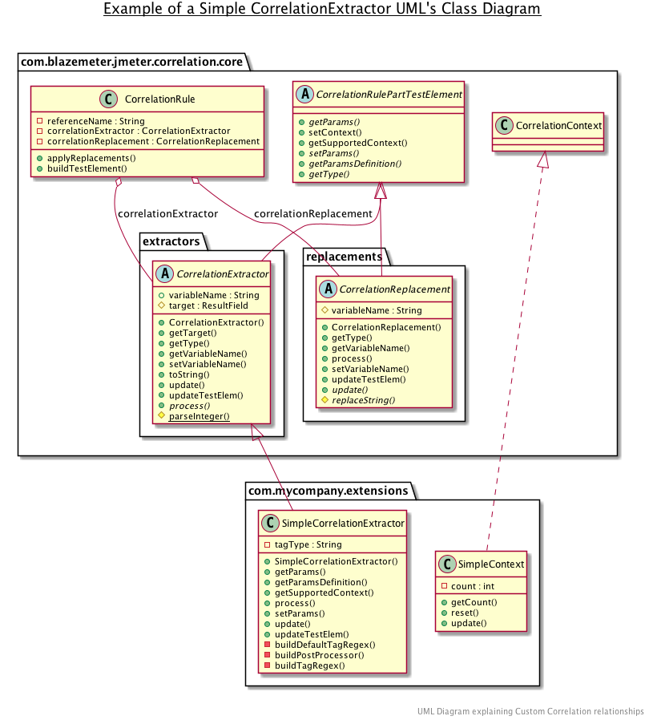

in the following section, back again into the app
<br>

<h4 align="center">Correlations Recorder Plugin for JMeter</h4>

<p align="center">Custom implementation of Correlations</p>

<p align="center">
  <a href="#requisites">Requisites</a> •
  <a href="#rules-structure">Rules Strucuture</a> •
  <a href="#references">References</a> •
</p>

## Requisites

Before jumping into the code, there is certain requisites that you will need to have

### Language

The developing language its **Java 8**, and the implementation should support until Java 11 LTS.

### Dependencies

We used maven to hold all our dependencies, its important that you share the same configuration that we are using. This its a reduced version of the minimum required for you to build a Correlation Extractor.

```XML
<?xml version="1.0" encoding="UTF-8"?>
<project xmlns="http://maven.apache.org/POM/4.0.0" xmlns:xsi="http://www.w3.org/2001/XMLSchema-instance" 
xsi:schemaLocation="http://maven.apache.org/POM/4.0.0 http://maven.apache.org/maven-v4_0_0.xsd">
   <modelVersion>4.0.0</modelVersion>
   <properties>
      <project.build.sourceEncoding>UTF-8</project.build.sourceEncoding>
      <project.reporting.outputEncoding>UTF-8</project.reporting.outputEncoding>
      <jmeter.version>3.3</jmeter.version>
   </properties>
   <dependencies>
      <dependency>
         <groupId>org.apache.jmeter</groupId>
         <artifactId>ApacheJMeter_core</artifactId>
         <version>${jmeter.version}</version>
         <scope>provided</scope>
         <exclusions>
            <exclusion>
               <artifactId>commons-logging</artifactId>
               <groupId>commons-logging</groupId>
            </exclusion>
         </exclusions>
      </dependency>
      <dependency>
         <groupId>org.apache.jmeter</groupId>
         <artifactId>ApacheJMeter_http</artifactId>
         <version>${jmeter.version}</version>
      </dependency>
   </dependencies>
</project>
```

Also, you should add the lastest version of the plugin into your project, so you can extend the functionalities, classes and methods that we have prepared for you.

One of the easiest ways to do so its adding JitPack to your dependency file and then point to the plugin repository and version. For further information on how add it to your project, refer to their [oficial documentantion](https://jitpack.io/).

## Rules Structure

As mentioned in the Readme file, one rule its based in 3 parts:

* A Reference Variable
* A Correlation Extractor
* A Correlation Replacement

Lets refresh those concepts

### Reference Variable
A Reference Variable its kind of a bridge between A Correlation Extractor and a Correlation Replacements.

Its the name of the variable where the information extracted from the Correlation Extractor, will be stored and, from where the Correlation Replacements will obtain the information to replace it in the configured Responses.

### Correlation Extractor

A Correlation Extractor its a part of the Rule that contains certain functions (like Regex, for example), that extracts from **each request**, the dynamic information and stores it into the predefined Reference Variable.

### Correlation Replacement

Later on, in every subsequent response, the Correlation Replacement will figure out where it needs to replace the *extracted information*, that its stored in the *Reference Variable* corresponding to the Rule it belongs to. 

### Order

Last, but not least, it's important to remind you the order on each Rule, and their C. Extractors/Replacements are applied:

1st: The order they appear in the Rules container, in the plugin, will determine the priority of each one. The higher it is, the faster it will be applied.
2nd: The C. Replacements will be applied first (in the case that any of the rules has a Replacement on it) in the request that its been performed.
3rd: The C. Extractors will be applied, with the response obtained when the C. Replacements were applied and, only to the Responses that pass the "Response Filter" field. In case of left blank, no filtering will be applied.

### Relationships 

The following diagram will contain all the relationships between the Rule and the previous mentioned parts.



To resume the UML Diagram:

Every Rule Will contain:

- One Reference Variable, which is a String
- One Correlation Extractor, which extends from CorrelationRulePartTestElement
- One Correlation Replacement, which also extends from CorrelationRulePartTestElement
 
During the process of making your Custom Correlation Extensions, you must extend one or another of the CorrelationRulePartTests elements, so the plugin can get the basic methods from it and place it with their respective set.

Its highly recommended that you check all those classes before continue.

### CorrelationRulePartTestElement
This class, located at: `com.blazemeter.jmeter.correlation.core.CorrelationRulePartTestElement`, contains all the methods that allows the plugin, not only to build the interface which will be able to configure the Extension but also manages the Contexts.

### CorrelationExtractor
This class, located at: `com.blazemeter.jmeter.correlation.core.extractors.CorrelationExtractor`, contains the basic structure to be able to target the Responses, save the values once configured and load the values from the files.

### CorrelationReplacement
This class, located at: `com.blazemeter.jmeter.correlation.core.replacements.CorrelationReplacement`, contains the basic structure to be able to target the Request, save the values once configured and load the values from the files.

**Process of making your Extension**
In order to develop your Custom Extensions, you can either:

- Create from scratch a brand new Extension, *extending* CorrelationExtractor/CorrelationReplacement, and implementing the desired customizations.
- Extend from an already created, tested and exposed CorrelationExtractor/CorrelationReplacement, and fix the logic so it behaves the way you want it to do.

We recommend that you do the later one, since its going to be easier to understand the flow of the plugin that way. You could take the whole, default installed, Siebel Extension pacakge, for example, located at `com.blazemeter.jmeter.correlation.siebel`. Each one of those Custom Extensions, extends from one our clases, and rewrite the logic to work on a Siebel Enviroment application.

Take the time to look at those files before going into the rest of the sections?

## Considerations

### A Valid Rule

A valid rule its the one that has all the necessary components to be able to be saved, loaded and applied when recording. Here are the considerations you need to have in mind while developing your own Custom Correlations:

**Reference Variable**
The Reference Variable must be *Unique* and *Non-Empty* for the rule to be considered a Valid One.

**Non Empty Rules**
Every rule can work, be saved and be loaded, if it has, at least a Correlation Extractor o Correlation Replacement, selected. By this we mean:

* A Rule with: a Reference Variable, a Correlation Extractor and no Correlation Replacement, is a valid rule.
* A Rule with: a Reference Variable, no correlation Extractor and a Correlation Replacement, is a valid rule.
* A Rule with: a Reference Variable, no Correlation Extractor and no Correlation Replacement, is an invalid rule.

### JComponents allowed for each rule

At this very moment, when creating the fiels for an Extension, the only allowed Components to be set are:

* JComboBox  (for list of static values)
* JTextFields (for variable values)

The values obtained by those Fields is received as an string, and will be set into the rule with the `setParams()` method.
From that point on forward, you must validate the non empty state of those values, and the required conversions (casting) of those values.

## Make your own extensions

**Its highly recommended that you check the Class diagram displayed in [Relationships](#relationships) before jumping into this section**


### Basic Relationship on each rule part 

The following set of rules should be followed in order to have correct access to all the capabilities that we program in the plugin. That been said, please follow this instructions:

1. Each CorrelationExtractor or CorrelationReplacement extends `CorrelationRulePartTestElement` 
2. Therefore, each Custom Extension that you develop should either extends CorrelationExtractor or CorrelationReplacement class, accordingly its type and moment it will be applied.

   **Note**: The only exception to this rule its when you want to enhance some functionalities of an already developed Extension, in that case, you could extends that class instead.

3. Each CorrelationExtractor or CorrelationReplacement has the possibility to use a CorrelationContext, that will allow to cover a more inclusive and extensive set of variables. The CorrelationContexts are shared between each Extension that has it is assigned to. Depending of your personal needs and the complexity of your project, you might want to make your very own.

4. By default, none of the CorrelationExtractor or CorrelationReplacement has implemented the method `getSupportedContext()` from `CorrelationRulePartTestElement` unless it has its very set of complex variables that need to share between rules and Correlations. Like you could check in the Siebel's Extensions.
 
5. Each Correlation must be named using this standard:

```
{Name of the Functionality of the Correlation} + "Correlation" + The Type
```

This is important, in most of the cases, to properly show the name of the Extension in the respective combo box.

#### Example

We developed a CorrelationReplacement that, when it finds a number, it replaces it for a value stored in the Reference Variable. That function might be called: *ReplacingNumbers*

Based on the naming standard, the respective name of the Extension should be: ReplacingNumbersCorrelationReplacement.

### Loading and Saving 

There are functions that need to be correctly implemented in order to save and load your Extension when Test Plans are saved. Be sure to check our implementations in case you have any doubt

#### Saving

After doing the whole process of setting the values to make a rule work, the user might want to save it, to prevent that data to be lost. The method that has the responsability to do that its the `updateTestElem`, which will receive one `CorrelationRuleTestElement` that contains all the information regarding one rule, and store them, separately, in properties.

```java
  @Override
  public void updateTestElem(CorrelationRuleTestElement testElem) {
    super.updateTestElem(testElem);
    testElem.setProperty("NAME_OF_VALUE_TO_SAVE", valueToSave);
  }
```

#### Loading

When thinking about loading the values of one correlation extension, the fundamental part needs to pay close attention its the `update` method. This will receive a `CorrelationRuleTestElement` that contains all the information regarding one Rule and stores those values as Properties.

The values will be loaded from a property that has a name, that name **must be consistent** with the one used, for that same property, at the moment it was saved, to been able to recover it.

```java
  @Override
  public void update(CorrelationRuleTestElement testElem) {
    super.update(testElem);
    tagType = testElem.getPropertyAsString("NAME_OF_VALUE_TO_SAVE");
  }
```


