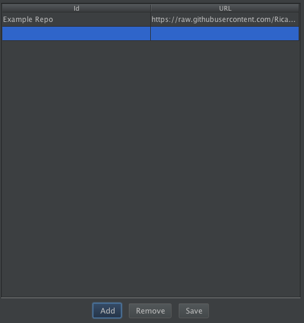

<br>

<h4 align="center">Correlations Recorder Plugin for JMeter</h4>

<p align="center">
  <a href="#about">About</a> •
  <a href="#installation">Installation</a> •
  <a href="#usage">Usage</a> •
  <a href="#updating">Updating</a> •
  <a href="#features">Features</a> •
  <a href="#contributing">Contributing</a> •
  <a href="#customizing-your-extensions">Customizing</a> •
  <a href="#license">License</a>
</p>

---

## About

<table>
<tr>
<td>
  
Correlations Recorder it's a JMeter's plugin that simplifies the process of recording for applications with Dynamic Variables by providing automatic **correlations of variables at recording time**.

After configuring the **Auto-correlation Rules**, you can start the recording like with the normal [HTTP(S) Test Script Recorder](https://jmeter.apache.org/usermanual/jmeter_proxy_step_by_step.html). The plugin will evaluate every Rule that you configured against every response from the server, correlate the dynamic variables found and allow future replays, work like a charm.

</td>
</tr>
</table>


## Features

|                            | Correlations Recorder | 
| -------------------------- | :----------------: 
| Easy to customize                      |         ✔️         | 
| Customizable Correlations              |         ✔️         |
| Shareable Templates                    |         ✔️         |
| Preloaded SIEBEL Templates             |         ✔️         |
| Auto Download and Install Repositories |         ✔️         |
| Customizable Extensions                |         ✔️         |
| Examples and Documentation             |         ✔️         |


## Installation

In this section we will speak about the prerequisites to install the plugin in your JMeter and the process to do it so.

### Prerequisites

In order to use the Correlations Recorder Plugin you need to:

1- Install the [Plugin Manager](https://jmeter-plugins.org/wiki/PluginsManager/) in your JMeter folder (if you haven't already). To get a more detailed Installation Guide, please check [this article](https://www.blazemeter.com/blog/how-install-jmeter-plugins-manager/) 
1- (Optional, for Siebel CRM Recording) Set the `httpclient4.deflate_relax_mode` property on true in your user.properties. Setting this property will allow you to avoid any `Unexpected end of input stream` type of errors and you will be able to record in Siebel environments without any troubles.

Remember to save all properties files and restart JMeter for those changes to be considered.

### Downloading and installing

After installing the JMeter Plugins Manager, the Correlation Recorder plugin will be available to automatically download and install it, to do so: 

- Open the JMeter Plugins Manager on JMeter
- Select the Available Plugins tab on JMeter Plugins Manager
- In the search field write Correlation Recorder, and then select the Correlation Recorder plugin’s checkbox
- Click the button Apply Changes and Restart JMeter

## Usage

In this section, we will cover the following topics
* [Backward Compatibility](#backward-compatibility)
* [Basic Concepts](#basic-concepts)
* [Configuration](#configuration) 

### Backward Compatibility

If you are migrating from the previous version, the Siebel's CRM Recorder, dont fear of missing your old configurations, we have implemented the compatibility with those Test Plans. Just load them as you would do and we will automatically migrate then to the new format. The reverse operation isn't supported in the Siebel's CRM Recorder.

### Basic Concepts

Before we jump into the configurations, and explain how to configure all the plugin to work in different scenarios, lets all be in the same page, just in case you might have some doubt about it.

#### Correlating Dynamic Variables

One of the many features that the plugin offers its the possibility of correlating dynamic variables while doing a recording. If you have come to something similar to this, or maybe never have hear about it, the following example will enlighten you out.

##### Simple Login Example

Imagine you are recording a flow where your user logs in and then logs out, the steps are pretty simple, right:

- Go to your login page
- Set the credentials
- Click on login
- (Once inside) Click logout
- Return to your login page

*In some cases*, a normal HTTP Recorder would do that flow without any problem. The thought part comes, when the application also validates dynamic variables like:

- Time of the login
- Session ID
- Form "secret" validation token

If you maintain the same values that you had **The First time you recorded**, the validations will kick in, and the application, will kick you out, not allowing you to finish the flow as expected.

That's the moment when the **Correlations Recorder Plugin** comes in. With some minor configurations, those dynamic values can be captured while you do the recording, and replaced in the following requests, so the app feels and behaves the way it would do, if it was you who logged 1000 times in a minute for your load testing.

**How a Correlation Works**

Based in our previous [Simple Login Example](#simple-login-example), one might have the need to deal with the problem that, some parts of the requests and the responses, might change. That's what its called **a dynamic variable** and, for those who wants to do, load testing, it could be problematic. 

In the previous [Simple Login Example](#simple-login-example), we could see that, some of the **Responses** that are sent by the server, might contain those **dynamic variables** and, in the following **Requests** that we sent to the server should contains them, in order to do the complete cycle. 

The process of **capturing dynamic variables** and **using them** in following request, its called [Correlation](#correlation).

#### Correlation 

Now that you know how the process works, lets talk about the players involved and how those interact between each other.

##### Correlation Extractor

When a **Response** comes from the server, there are ways to get the information, depending on where the value its changing:

- It could change on the URL, for example, using an ID or a Token
- It could be en the Body, set in a field (visible or hidden)
- It could be stored on a Cookie, that has an expiration date

The Correlation Extractor has, as its main responsibility, locate if in any of these cases, there are embedded dynamic variables. In the case where there are, its second responsibility is to extract and save the value so that, in future requests that the app made, other players take those values and replace it, allowing the full cycle to be completed.

##### Correlation Replacement

Now that its known who its the one responsible to extract the values from the responses, its the responsibility to the Correlation Replacement to take those values and replacement them in the following requests, made to the server. 


##### Reference Variable

Even if its not part of the process of correlating dynamic values, when one its extracted, the name of the place where its stored, and from where its going to be taken, in order to replace it, in the subsequent requests, its called Reference Variable. 

Everything that its been explained, so far, will be used in one final tool: a Correlation Rule.

##### Correlation Rule

Once all those concepts are explained, the tool that allows to merge them together, its the Correlation Rule.

Each Correlation Rule contains, a Correlation Extractor, as you now know, to extracts the dynamic value, a Reference Variable, to store the value from the Extractor for the the Replacement, and one Correlation Replacement.

Each one of these rules, will help to make this whole process of capturing and replacing values between responses and requests, not only possible, but also easier than if you manage to do it, alone, using JMeter.

In the following section, we will be talking about how to configure and set the values in each Correlation Rule.

### Configuration

Assuming you know how [Correlations works](#basic-concepts), lets jump into adding and configuring your rules.

Go to Correlation Recorder > click the Rules Tab. 

You will be presented with multiple options to add, save, move and delete your Correlation Rules. 


### Adding Rules

When clicking the *Add* button, an empty Correlation Rule will be added at the bottom of your list of rules. 

As you might be guessing, the rule might contains: a Reference Variable, a Correlation Extractor and a Correlation Replacement. Each one of these fields can be seen in the rule, in that order.


Also, if you stand over each one of them, a helper tooltip will appear.


#### Selecting a Correlation Extractor

By default, the only Correlation Extractor available, it's going to be Regex.  You can select it clicking on the first combo box of each rule, doing so, will display all the fields required to configure it.


Filling all the fields, with the desired parameters, will allow the plugin to Extract the dynamic values from the responses.

More about how to configure each Correlation Extractor (this and the ones that comes with the Siebel Extension), please refer to our [List of Correlation Extractors](#list-of-correlation-extractors) section.

#### Selecting a Correlation Replacement

Just like the Extractors, Correlation Replacements comes with their very own default values: Function and Regex.


And their behavior goes sames as its predecessor. Once one option its selected, the fields to configure it, will be displayed right next to it.

More about how to configure each Correlation Replacements (this and the ones that comes with the Siebel Extension), please refer to our [List of Correlation Replacements](#list-of-correlation-replacements) section.

Note that, each time you select a different Extractor or Replacement, inside your correlation rule, the values that you had set to the respective fields, will be lost. For Saving your Rule configurations, before getting creative, please refer to the [Saving and Loading Rules](#saving-and-loading-rules) section.

#### Reference Variable

Once a value its extracted for the Correlation Extractor, its stored in a variable, this field will determine the name of it. In future request, the Correlation Replacement will be applied and, if it successfully finds the place to apply it, will bring the value from here and replacement it there, for a smooth transition.

### List of Correlation Extractors

All the Correlation Extractors mentioned below comes either installed by default in the plugin, or as a part of the preloaded Siebel Template. To know more about how to load and save Correlation Rules Templates, please refer to the [Saving and Loading Rules](#saving-and-loading-rules) section, for further details about it.

In case none of the following ones fits the desired behavior your application requires, to correlate the dynamic variables that it might have, feel free to read the [Customizing your one extensions](CUSTOM_EXTENSIONS.md) section that we have prepared for you.

**Regex**

RegEx stands for Regular Expression, and relies on the use of Regular Expressions to find where the dynamic variable might found.

When the regular expression its matched, a Regex Extractor will be added to the sample where the match occurs. 

This extractor comes installed, by default, in the plugin, and it receives 4 fields to be able to work properly:


1. *RegEx*: which corresponds to the Regular Expression that will be used to perform the extraction.
2. *Match Number*: In the case that the Regex matches more than once in the response, this number will indicate which one of all of them it's going to be extracted.
3. *Match Group*: In the case that the Regex contains, more than one group, this field indicates which one of those its going to be considered to do the extraction, once the Regex its matched.
4. *Field to check*: Which field to check the regular expression against.
      * *The following fields can be checked: (from JMeter documentation):*
      * *Body* - the body of the response, e.g. the content of a web-page (excluding headers)
      * *Body (unescaped)* - the body of the response, with all Html escape codes replaced. Note that Html escapes are processed without regard of context, so some incorrect substitutions may be made. Note that this option highly impacts performances, so use it only when absolutely necessary and be aware of its impacts.
      * *Body as a Document* - extract text from various type of documents via Apache Tika. Note that Body as a Document option can impact performance, so ensure it is OK for your test.
      * *Request Headers* - the request header of the HTTP sampler.
      * *Response Headers* - the response header of the HTTP sampler.
      * *URL*
      * *Response Code* - e.g. 200
      * *Response Message* - e.g. OK

**SiebelRow**

This Correlation Extractor comes in the already installed Siebel's Template. To know more about how to load and save Correlation Rules Templates, please refer to the [Saving and Loading Rules](#saving-and-loading-rules) section, for further details about it.

The Siebel Row Correlation Extractor works in a similar way like the previously mentioned RegEx, with the main differences that:
 
- This applies a "Siebel Star Array strings" parsing function over the matched regex and store the parsed values as variables. 
- Regarding the Parameters expected, Siebel Row Correlation Extractor uses all but the *Match Number*, since it parses every match it founds.
- Last, but not least, if the Regex its matched, a JSR223PostProcessor will be added to the sampler.

*For a better understanding, lets do an example*

Let's say that the String we want to extract and, therefore, apply this extracting and parsing function, its

`8\*testUser12\*testPassword6\*VRId-0`

The plugin will searches for the number before an occurrence of "\*", uses that value as the length of the number of characters to store, and then repeats if there is another occurrence of "*".

If the Reference Variable is set to *VAR*, the split strings returned will be set in variables names like ${VAR_1}, ${VAR_2}, ${VAR_3} etc. and, the count of variables is returned as ${VAR_n}. 

The stored values for that string, at the end, will be:

* VAR_n=3 
* VAR_1=testUser 
* VAR_2=testPassword 
* VAR_3=VRId-0 

### Star Array Correlation

When the server returns variables using a star array, the plugin will parse the array and generate a new variable for each of the parameters, using the specified prefix name.

### List of Correlation Replacements

All the Correlation Replacements mentioned below comes either installed by default in the plugin, or as a part of the preloaded Siebel Template. To know more about how to load and save Correlation Rules Templates, please refer to the [Saving and Loading Rules](#saving-and-loading-rules) section, for further details about it.

In case none of the following Replacements fits the desired behavior your application requires, to correlate the dynamic variables that it might have, feel free to read the [Customizing your one extensions](CUSTOM_EXTENSIONS.md) section that we have prepared for you.

**Regex**

Similarly to the *Correlation Extractor Regex*, this one also receives a Regular Expression in order to find where the stored value its going to be replaced.

**Siebel Counter**

This Correlation Replacement replaced the matched regex with a counter that holds the value of each time it has matched on the moment the replacement occurs.

**Siebel Row Id**

This replacement adds *_rowId* to the Reference Variable name before each replacement, and search the value of the regex on rows of the Siebel Context. After this, it behaves like a regular RegEx Replacement using the Siebel Context

**SiebelRowParams**

Similarly to the rest of the Correlation that involves Regex, this Replacement will receive a Regular Expression as param, its going to search for the first occurrence of the first group of (), inside the Siebel Context values, extracted previously by the SiebelRow's CorrelationExtractor, and replace the respective value following the formula `RefVar` + _ + `RowNumber`.

### Delete and Clear

Additionally to Add, functionalities like Delete and Clear, might come handy.

When selecting a rule (setting the whole rule with a different background), you can delete it by clicking the Delete button. Also, if you want to delete all the rules that you have until now, pressing Clear will do the trick.

If you delete or clear your rules, they will be lost, and there is no way of recovering then after that. So before doing so, remember that you can always [Save Your Correlation Rules into Templates](#saving-and-loading-rules), before deleting some or removing all at once.

### Priorities

Before you run your recorder and test your rules against the app, its **IMPORTANT** to mention that the order of rules, in your Rules Container, indicates the priority they have, therefore, the order in which they will be applied to every Request and Response.

If you want to change the priorities, you can use the UP and DOWN buttons, after selecting any rule, to move it up and down, respectively.

## Saving and Loading Rules  

One other feature that the plugin allows, its the possibility of saving a set of rules, also known as **Correlation Templates**, without the need of saving the whole Test plan. You can load your previous saved templates or even other ones shared by third parties. To know more about sharing templates, please refer to our [Sharing Repositories](#sharing-repositories) section, for further details.

### Saving your Templates

Once you are finished configuring your Correlation Rules, you are able to save it. By default, it will take a screenshot of the rules you have in your application. This image, know as the snapshot, can be replaced by yourself if you desire to change it.

**How to Save your Rules**

Click on the Save Template Button in the Top Left corner of the Correlations Rules Container. 

The following Form will appear:


No need for your to figure each one by yourself, the following list does it for you:

* ID: Its an "identification name" for your Correlation Template. **It has to be unique**, or the plugin won't allow you to save it.
* Version: This its very self-explanatory field. Depending on how many times you have loaded and saved your template, you can set a version "name" (since it doesn't need to be a number). Just like the ID, **it has to be unique**.
* Description: Its a field that allows you to explain more about your Template. You can get creative and, also, add HTML tags. (Paragraphs, bold, links, etc).
* Changes: This field allows you to keep track of the changes made on the Template.
* Dependencies: This field allows you to add any particular library (.jar) file that your Template needs in order to work.


Since its an **Advanced** feature, we left it collapsed by default.
Its IMPORTANT that, if you decide to add a dependency, the name and the version should be contained in the final file, that way, we can recognize it from the rest of the versions it might have.
Also, any overlapping dependencies, after an alert dialog, will be overwritten it, leaving just the one that was added at the end.

### Loading Templates

No matter if the Correlation Templates on your system are yours or if they come from another person, when you click on "Load Template", in the Left Top Corner of the Correlations Rule container, the Correlation Template Manager will appear.

In this Manager you can see the Installed and the Available Templates. The first ones will contain, at least, one of its versions installed in your system, the later are all downloaded but, none of its versions are installed.

To been able to load a Correlation Template in your Rules container, you need, first, to install it. Installing a version of a Template that has already a version installed, will overwrite the previous one.

Once you install a Template, you will be able to load it in the Rules container, and use it as it was saved.

Its important to mention that, every time you load a Template, the rules, filters and extensions contained inside that template will be appended to the ones you have already built in your Rules Container, this way, you can use as many templates as you want before doing one recording. 

When you load a single template, edit it and attempt to save it, the information of that last loaded template will, by default, be set in the "Save Template" form, allowing you to update it as a local version of it. That behavior changes when you load more than one template or when you press the "Clear" Button.

**NOTE**

If one Template's Version contains dependencies that overlap with other dependencies in the `/lib` folder, an alert will be shown that, if accepted, will delete all "conflicting" dependencies in that folder. You might need to take actions here in the case you don't want those dependencies lost.

Once you have installed Repositories ( as explained in [External Repository](#external-repository)), you will also see the Templates from those Repositories in the list as well. The ones created or saved, in your machine, will be followed by a `(local)` suffix on their name. All Templates will always contain the ID of their Repository Owner, also, in the description.

### Default Templates

By default, the plugin creates a Template with the most commonly used Siebel Correlation rules

When the Siebel Template its loaded, a set of rules with the most common Siebel dynamic values that need to be parameterized will be added. 

## Sharing Repositories

One amazing feature that the plugin has its the possibility to add and share sets of templates, as one, also known as **Repository**. One Repository might contain different versions of one same Template, or even multiple versions or different templates. 

In this section you will learn: how to import third parties Repositories, to extend your Load Testing and how to share yours

### External Repository

In the case that someone has offered to share their custom rules for certain applications, you can either download it by your means, and use the local route, or you can use the URL of the repository and let the Plugin to download it for you.

To add external Repositories, go to your Rules Container > Click on Load Templates > Click on Config. After that, you will be presented with the Repositories Manager



**Adding a Repository**

To add a new Repository: 

* Set an **unique** name 
* Set the path or url where the Repository its located
* Click on Add

After that, the plugin will do its magic and a message will appear indicating either the Repository was successfully added or if it was any problem.

**View Templates within a Repository**

As mentioned in [Loading Templates](#loading-templates), to see any Template that belongs in a Repository, go to your Templates Manager (Load Template, Top Left Corner in the Rules Container), click on the search field and write the name of the Repository.

Either in the Installed or in the Available tabs (depending if the Template has installed versions or not), the Templates associated to that search text, will be shown.


### Local Repository

### Sharing your Repository

# Making your own Repositories

By default, when you save one template, it gets recorded in your Local Repository. If you decide to export certain set of Templates, to share or just simple to store somewhere else, you need to follow this steps.

1. Copy the local-repository.json file into a new folder (Example: MyRepository/)
2. Open the local-repository.json file and remove the templates you dont want to use, leaving the ones you want to export

	When you open the local-repository.json file, you will see that it has the following structure:
	
	```JSON
	{
	  "name" : {
	    "versions" : [ "versionId" ]
	  }
	}
	```
	
	**Where**:
	
	name: its the name of the template that you are have in your local repository
	versions: its an array with all the versions of that template
	versionId: its the id or the name of the version of that template.
	
	**For example**:
	
	If we want to export a repository that contains the version 1.0 and 2.0 of the Template "Social" and version 0.1 of the Template "Media", the repository file would look like this:
	
	```JSON
	{
	  "Social" : {
	    "versions" : [ "1.0", "2.0" ]
	  },
	  "Media" : {
	    "versions" : [ "0.1"]
	  }
	}
	```

3. Add all the JSON files of the templates you mentioned in the repository file
4. (Optional) Add all the snapshots for the templates

Also, there are considerations you need to have in mind to been able to access this file, and download it:

1. Every file should be on the same level. No sub-folders are required
2. Depending where the folder would be:
   - If you upload this folder in the cloud: the URL to access those files need to be publicly available
   - If you share the folder: the folder should be readable
3. All the files must maintain the original names or, at least, follow the structure.

**File Naming Structure**

In this section, we will list the name structure for the files contained in a repository

| Type       | Formula                                                         | Example                      |
| ---------- | --------------------------------------------------------------- | ---------------------------- | 
| Repository | `[Repository name] + repository.json`                           | *example-repository.json*    |
| Template   | `[Template Name] - [Template Version] + -template.json`         | *twitter-1.0-template.json*  |
| Snapshot   | `[Template Name] - [Template Version] + -snapshot.png`          | *snapshot-1.0-template.json* |


## Filtering your Requests

One of the features that the Correlation's Recorder offers, is the possibility to filter the responses that will be recorded.


The filtering applies based on the MIME Types of the response and, the strings used in this field can be:

* Specific: using the whole MIME type you want to filter. eg: `text/html`
* Generic: using regular expressions. eg: `text\/(html|css)`
* Multiple: using any combination of the mentioned so far, comma separated. eg: `text/html, application\/(json|xml)`. 

For more information about the MIME types definitions and/or most used ones, check [Iana's definitions](https://www.iana.org/assignments/media-types/media-types.xhtml) or [mozilla's HTTP Guide](https://developer.mozilla.org/en-US/docs/Web/HTTP/Basics_of_HTTP/MIME_types) or .

## Updating Plugin

As easy as a pair of clicks, my friend! You have two ways of updating to our [last version](https://github.com/Blazemeter/SiebelPlugin/releases):

##### 1. If you have been using JMeter's Plugin Manager:
* Go to Options
* Plugins Manager
* Click in the Upgrades Tab
* Select Correlations Recorder
* Click "Apply Changes and Restart JMeter"

And you are ready to go

##### 2. If you are using the plugin as dependency in your project:

* Check the [last version](https://github.com/Blazemeter/SiebelPlugin/releases) release name
* Replace it in your dependencies file (pom, groovy, etc)
* ReImport

And there you go! The latest version most be in your project and you are ready to keep customizing!

**NOTE**: Remember to review our lastest changes, some functionalities might have changed and the way you implemented your extensions could be affected.

## Making your own extensions

Need more correlation functionalities? We got you covered! 

Please refer to our [Customizing your one extensions](CUSTOM_EXTENSIONS.md) guide and get, your custom Correlation Extractors and Replacements, to another level.

## Compatibility
The plugin has been tested with JMeter 3.2, 3.3, 4.0 and 5.2 in Java 8 and 9.

Code base is implemented in Java 1.8, so lower versions of JVM are not supported.

## Contributing

Got **something interesting** you'd like to **share**? Learn about [contributing](https://github.com/Blazemeter/SiebelPlugin/blob/master/CONTRIBUTING.md).

## License

Apache License 2.0

```text
A permissive license whose main conditions require preservation of copyright and license notices. 
Contributors provide an express grant of patent rights. Licensed works, modifications, and larger 
works may be distributed under different terms and without source code.
```

To know more about it, read the license [here](https://github.com/Blazemeter/SiebelPlugin/blob/master/LICENSE)
