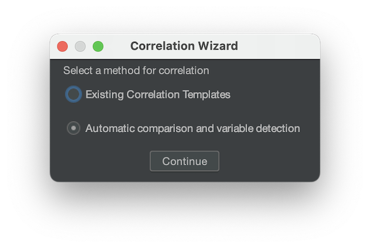
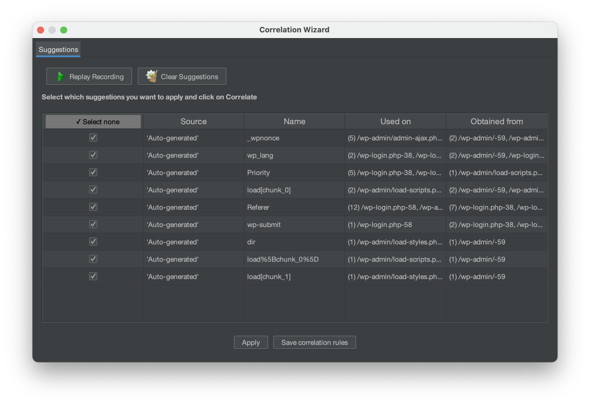

# Automatic Correlation methods

This section covers the Automatic Correlation methods available in the plugin. These methods allow you to
automatically correlate dynamic values in your recordings. Unlike the Correlation Rules method, which must be
configured before recording, these methods are performed after the recording is complete. This provides greater
flexibility, as the correlations can be reviewed and rolled back if necessary.

We'll discuss the pros and cons of each method to help you determine which one is best suited for your needs.

**Supported methods**

At this stage, the supported methods can correlate by:

- [By Using Correlation Templates](#by-using-correlation-templates)
- [By Automatic comparison and variable detection](automatic-comparison-and-variable-detection)

Let's see what each one of these methods has to offer.

## By using Correlation Templates

This method involves analyzing a recording using different Correlation Templates to automatically detect dynamic
values. It generates a list of Correlation Suggestions based on those values, and lets you choose which ones
to apply in the Test Plan.

Pros:

- This is the most reliable method as it only correlates the dynamic values found with the rules in the Correlation Template.
- It lets you test any set of Correlation Rules before applying them to the Test Plan.
- You can easily roll-back changes made to the Test Plan as it stores it in a separate file.
- It integrates with the Correlation Repository feature, allowing you to use the Correlation Templates from BlazeMeter,
  GitHub or any other sources, aside from your local ones.

Cons:

- It still requires Rules to properly correlate the dynamic values.
- It does not detect dynamic values that are not present in the Correlation Templates.

### Usage

::: details Quick step guide

1. Open the Correlation Wizard
1. Select the **Automatic comparison and variable detection** method.
1. Add the JTL file of the recording (if it isn't already loaded).
1. Press "Continue"
1. Review the Correlation Suggestions
1. Press "Auto Correlate" to apply the suggestions to the Test Plan.
   :::

**Detailed steps**

1. Open the Correlation Wizard

To open the Correlation Wizard, you can either:

- Accept the replay report Dialog, after the recording.
- Click on the **Correlation Wizard** button in the **Correlation** tab.

2. Select the **Existing Correlation Templates** method

3. Select the Templates to use for the analysis

The next step is to select the Correlation Templates to use for the analysis. You can select one or more templates.
If you select more than one, the plugin will use the union of the dynamic values found in all of them.

By default, the latest version of a Template is selected, but you can change that by clicking on the field in the Version column.

::: warning

If you have the BlazeMeter integration on, depending on your account type (Free or Enterprise), you might see some
Correlation Templates that are not available for you (they will have a lock icon next to them).

If you want to know more about Enterprise Correlation Templates, please contact your BlazeMeter representative.
:::

4. Add the JTL file of the recording (if it isn't already loaded)

By default, the plugin loads the JTL file that is found in the View Result Tree of the "bzm - Correlation Recorder" element.
If you want to use a different JTL file, you can click on the "Browse" button and select the file you want to use.

::: warning
It is highly recommended that you use the JTL file that that comes from the recording, since it contains the
raw data of the recording. If you use a different JTL file, the analyzed data might not be accurate, hence
the results might not be as realistic as expected.
:::

5. Press "Continue"
6. Review the Correlation Suggestions
   Once the analysis is done, the plugin will display the Correlation Suggestions.

Review the name of the arguments, the values, where they were found and used. If you want to apply a suggestion,
select the checkbox next to it. If you want to ignore a suggestion, uncheck the checkbox.

7. Press "Apply" to apply the suggestions to the Test Plan.

The plugin will automatically correlate the dynamic values in the Test Plan, and will display a dialog informing you
that the process was successful.

### Forcing the correlation of a dynamic value

As mentioned earlier, the plugin will only try to correlate the parameters in the requests that failed during the replay. If a request does not fail (for example, it returns a 200 status code), but you still want the plugin to include it in the automatic correlation process, you can force it by adding an assertion to the request.

To add an assertion to an HTTP request in JMeter, follow these steps:

1. Open your JMeter test plan and navigate to the Thread Group where the HTTP request is located.
1. Select the HTTP request and right-click on it.
1. Click on "Add" and then select "Assertions".
1. Choose the type of assertion you want to add (for example, "Response Assertion").
1. Configure the assertion by specifying the criteria that must be met for the assertion to pass.
1. Save your changes and run the test again.

Official documentation: https://jmeter.apache.org/usermanual/test_plan.html#assertions

## Automatic Comparison and Variable Detection

This method involves analyzing the results of a recording replay by comparing them with the original recording. It
only focuses on the arguments of the requests that failed in the replay. By doing so, it generates a list of
Correlation Suggestions based on the differences found, allowing you to select which ones to apply in the Test Plan.

**Pros and Cons**

Pros:

- It is pretty flexible, since it detects dynamic values that you might not be aware of.
- It is customizable, since you can configure how the analysis is done.

Cons:

- It is not 100% bullet-proof, since it might correlate dynamic values that are not necessarily dynamic

### Usage

::: details Quick step guide

1. Open the Correlation Wizard.
   - If you have done a recording you can confirm the generation of correlation suggestions which redirects you to Correlation Wizard
1. Select the **Automatic comparison and variable detection** method.
1. Review the Correlation Suggestions
1. Press "Apply" to apply the suggestions to the Test Plan.

:::

**Detailed guide**

1. Open the Correlation Wizard

To open the Correlation Wizard, you can either:

- Accept the replay report Dialog, after the recording.
- Click on the Correlation Wizard button in the Correlation tab.

2. Select the **Automatic comparison and variable detection** method

After pressing continue the generation of suggestions has began, depending on the complexity of the scenario this step might take while.

3. Review Correlation Suggestions

Review the name of the arguments, the values, where they were found and used. If you want to apply a suggestion, select the checkbox next to it. If you want to ignore a suggestion, uncheck the checkbox.

4. Press "Apply" to apply the suggestions to the Test Plan.

The plugin will automatically correlate the dynamic values in the Test Plan, and will display a dialog informing you that the process was successful.

