# Before the Recording

When we say 'Before the Recording,' it is meant to refer to the process between when the Correlation Template is
loaded into JMeter and when the recording is completed. We use this terminology instead of saying 'while it is
being recorded' because this method requires you to properly configure the plugin before performing the
recording using what is known as a Correlation Rule (or Rule for short).

Once you have finished configuring the rules, you can start the recording, and the plugin will automatically
compare each request and response with the configured rules

Pros:
- It is the most flexible method, since you can configure it to your needs.
- It is the most efficient method, since it is the only one that does not require you to replay the recording.
- It supports extensibility, allowing you to develop your own rules according to your needs.

Cons:
- It requires you to configure the rules before the recording is done.
- It required prior knowledge of potencial dynamic values, and how to configure the rules to extract them.
- It requires a re-recording in order to test the changes made to the rules.
- It doesn't support rolling back changes made to the recording, since the elements are modified in the recording itself.

Now, lets talk about the Correlation Rules and their parts.

## Correlation Rules

Now that you know how the process works, lets talk about the players involved and how those interact between each other.

## Correlation Extractor

When a **Response** comes from the server, there are ways to get the information, depending on where the value its changing:

- It could change on the URL, for example, using an ID or a Token
- It could be en the Body, set in a field (visible or hidden)
- It could be stored on a Cookie, that has an expiration date

The Correlation Extractor has, as its main responsibility, locate if in any of these cases, there are embedded
dynamic variables. In the case where there are, its second responsibility is to extract and save the value so
that, in future requests that the app made, other players take those values and replace it, allowing the full
cycle to be completed.

## Correlation Replacement

Now that its known who it's the one responsible to extract the values from the responses, it's the responsibility
to the Correlation Replacement to take those values and replacement them in the following requests, made to the server.

## Reference Variable

Even if it's not part of the process of correlating dynamic values, when one its extracted, the name of the place
where its stored, and from where its going to be taken, in order to replace it, in the subsequent requests,
it's called Reference Variable.

Everything that it's been explained, so far, will be used in one final tool: a Correlation Rule.

# Correlation Rule

Once all those concepts are explained, the tool that allows to merge them together, it's the Correlation Rule.

Each Correlation Rule contains, a Correlation Extractor, as you now know, to extracts the dynamic value,
a Reference Variable, to store the value from the Extractor for the Replacement, and one Correlation Replacement.

Each one of these rules, will help to make this whole process of capturing and replacing values between responses and
requests, not only possible, but also easier than if you manage to do it, alone, using JMeter.

### Configuration

Assuming you know [how Correlations works](#basic-concepts), lets jump into adding and configuring your rules.

Go to *bzm - Correlation Recorder* > click the Rules Tab.

You will be presented with multiple options to add, move and delete your Correlation Rules Groups, any rule that you want to add must be inside a group

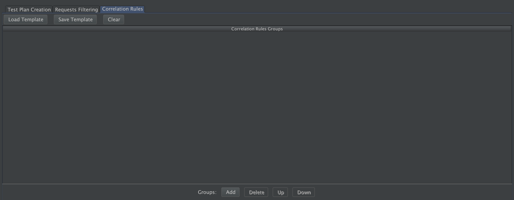

### Adding Groups

When clicking the *Add* button, a Correlation Group will be added at the bottom of your list of groups.

Each group will contain the header with the buttons to enable/disable, editing group name, and add, remove and move the rules inside the group. Below the header, it is placed the table which will contain all the rules associated to that group

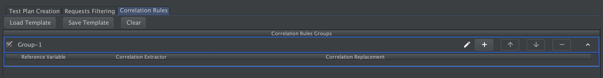

### Adding Rules

When clicking the **+** button, a Correlation Rule will be added at the bottom of your list of rules.

Each rule will contain a field in each one of the columns: Reference Variable, Correlation Extractor, and Correlation Replacement

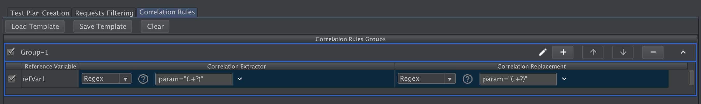

Each Correlation Extractor and Correlation Replacement Combo will have a helper icon, right next to it that, when clicked, will display information regarding it (_What it does?_ and _How to customize it?_)


#### Selecting a Correlation Extractor

By default, when a Correlation Rule is added, it will have automatically selected the Regex Correlation Extractor. You can change it by clicking on the combo box on the Correlation Extractor column of that Rule.

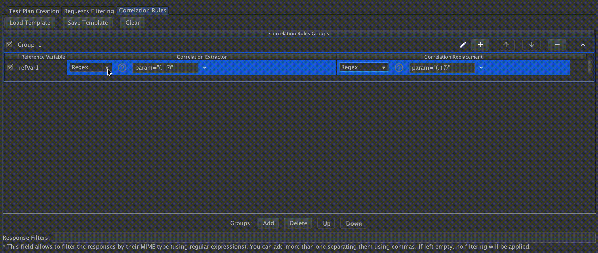

Each type of Extractor has its own set of parameters, some of them are visible when the extractor is selected, but the advanced ones are hidden by default, those are shown when the parameters section is expanded.


By default, only Regex extractor will be able to be selected, to select other of the extractors available or a custom extractor there is an option **More** in the combo box which will display all the available extractors, here the desired extractor should be selected and added to actives extractors.


If another Extractor is selected, the previous values will be deleted. Filling all the fields, with the desired parameters, will allow the plugin to Extract the dynamic values from the responses.

More about how to configure each Correlation Extractor (this and the ones that comes with the Siebel Extension), please refer to our [List of Correlation Extractors](#list-of-correlation-extractors) section.

#### Selecting a Correlation Replacement

Just like the Correlation Extractors, the Regex Correlation Replacement will be selected, by default, when adding a Correlation Rule.

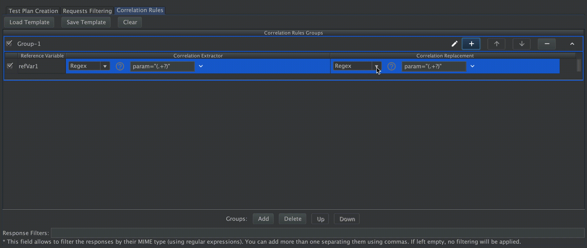

Also, Correlation Replacements have their own Advance section, like Correlation Extractors

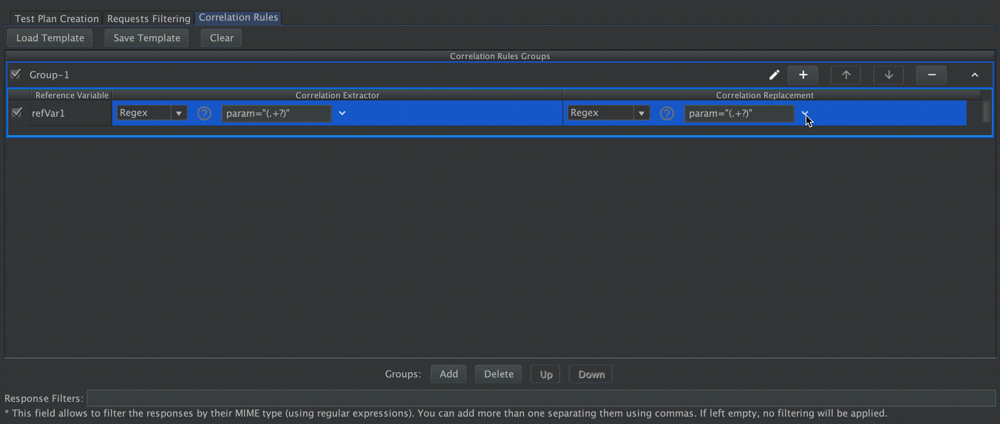

As in Correlation Extractor, here to add any Correlation Replacement the option  **more** should be used.


And their behavior goes sames as its predecessor. Once one option its selected, the fields to configure it, will be displayed right next to it.

More about how to configure each Correlation Replacements (this and the ones that comes with the Siebel Extension), please refer to our [List of Correlation Replacements](#list-of-correlation-replacements) section.

Note that, each time you select a different Extractor or Replacement, inside your correlation rule, the values that you had set to the respective fields, will be lost. For Saving your Rule configurations, before getting creative, please refer to the [Saving and Loading Rules](#saving-and-loading-rules) section.

#### Reference Variable

Once a value its extracted for the Correlation Extractor, it's stored in a variable, this field will determine the name of it. In future request, the Correlation Replacement will be applied and, if it successfully finds the place to apply it, will bring the value from here and replacement it there, for a smooth transition.

### List of Correlation Extractors

All the Correlation Extractors mentioned below comes either installed by default in the plugin, or as a part of the preloaded Siebel Template. To know more about how to load and save Correlation Rules Templates, please refer to the [Saving and Loading Rules](#saving-and-loading-rules) section, for further details about it.

In case none of the following ones fits the desired behavior your application requires, to correlate the dynamic variables that it might have, feel free to read the [Customizing your one extensions](custom-extensions) section that we have prepared for you.

**Regex**

RegEx stands for Regular Expression, and relies on the use of Regular Expressions to find where the dynamic variable might found.

When the regular expression its matched, a Regex Extractor will be added to the sample when:

1. The Regular Expression is matched, based on the configured properties
2. The matched value is not repeated

This extractor comes installed, by default, in the plugin, and it receives 4 fields to be able to work properly:

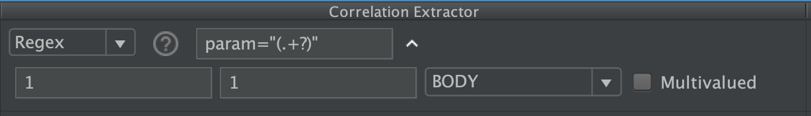

1. *RegEx*: which corresponds to the Regular Expression that will be used to perform the extraction.
1. *Match Number*: In the case that the Regex matches more than once in the response, this number will indicate which one of all of them it's going to be extracted. Use the value `-1` when you need to retrieve all matched values from the expressions.
1. *Match Group*: In the case that the Regex contains, more than one group, this field indicates which one of those is going to be considered to do the extraction, once the Regex its matched. Only use positive numbers.
1. *Target*: Which field to check the regular expression against.
    * *The following fields can be checked: (from JMeter documentation):*
    * *Body* - the body of the response, e.g. the content of a web-page (excluding headers)
    * *Body (unescaped)* - the body of the response, with all Html escape codes replaced. Note that Html escapes are processed wi thought regard of context, so some incorrect substitutions may be made. Note that this option highly impacts performances, so use it only when absolutely necessary and be aware of its impacts.
    * *Body as a Document* - extract text from various type of documents via Apache Tika. Note that Body as a Document option can impact performance, so ensure it is OK for your test.
    * *Request Headers* - the request header of the HTTP sampler.
    * *Response Headers* - the response header of the HTTP sampler.
    * *URL*
    * *Response Code* - e.g. 200
    * *Response Message* - e.g. OK
1. *Multivalued*: Multiple valuation is useful when we want to separate each unique value as a particular variant name from different responses. Variables extracted with multivalued are non-overwritable and additionally they have a specific format.  See [Variable Generation](#variable-generation) for case usages and variable formats.
   In case the Regex Extractor is not matched, during a Replay of a Recorded flow, the replaced value will be `<Reference Variable Name> + "_NOT_FOUND"`.

**JSON**

JSON stands for JavaScript Object Notation, and relies on the use of JSONPath Expressions to find where the dynamic variable might found.

When the JSONPath its matched, a JSONPath Extractor will be added to the sample when:

1. The JSONPath is matched, based on the configured properties
2. The matched value is not repeated

This extractor comes installed, by default, in the plugin, and it receives 4 fields to be able to work properly:

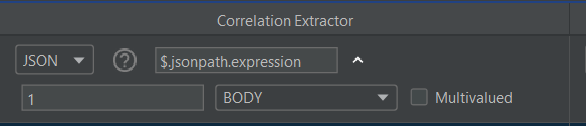

1. *JSON*: which corresponds to the JSONPath Expression that will be used to perform the extraction.
1. *Match Number*: In the case that the JSONPath matches more than once in the response, this number will indicate which one of all of them it's going to be extracted. Use the value `-1` when you need to retrieve all matched values from the expressions.
1. *Target*: Which field to check the regular expression against.
   * *The following fields can be checked: (from JMeter documentation):*
   * *Body* - the body of the response, e.g. the content of a web-page (excluding headers)
1. *Multivalued*: Multiple valuation is useful when we want to separate each unique value as a particular variant name from different responses. Variables extracted with multivalued are non-overwritable and additionally they have a specific format.  See [Variable Generation](#variable-generation) for case usages and variable formats.
   In case the JSONPath Extractor is not matched, during a Replay of a Recorded flow, the replaced value will be `<Reference Variable Name> + "_NOT_FOUND"`.

JMeter use JSONPath syntax from [Jayway JsonPath](https://github.com/json-path/JsonPath) Use the Jayway JsonPath syntax documentation as a reference.

Jayway JsonPath is a java port based on [Stefan Goessner's original JSONPath implementation](https://goessner.net/articles/JsonPath/).

It is possible to find multiple examples of JSONPath expressions on the websites mentioned above or on the Internet.

JMeter allows you to evaluate JSONPaths in the Sample results of the ViewResult using the view "JSON Path Tester". However, it is possible to use some other tools on the Internet that facilitate the evaluation and testing of JSONPath, such as the site [jsonpath.com](https://jsonpath.com/)

**JSONPath Example**

An example will be provided below that will allow you to visually understand some general concepts of the JSONPath syntax.

```json
{ "store": {
    "book": [
      { "category": "reference",
        "author": "Nigel Rees",
        "title": "Sayings of the Century",
        "price": 8.95
      },
      { "category": "fiction",
        "author": "Evelyn Waugh",
        "title": "Sword of Honour",
        "price": 12.99
      },
      { "category": "fiction",
        "author": "Herman Melville",
        "title": "Moby Dick",
        "isbn": "0-553-21311-3",
        "price": 8.99
      },
      { "category": "fiction",
        "author": "J. R. R. Tolkien",
        "title": "The Lord of the Rings",
        "isbn": "0-395-19395-8",
        "price": 22.99
      }
    ],
    "bicycle": {
      "color": "red",
      "price": 399
    }
  }
}
```

Some JSONPath query expressions and their expected result.

| JSONPath                    | Intended result                                                   |
|-----------------------------|-------------------------------------------------------------------|
| $.store.book[*].author      | the authors of all books in the store                             |
| $..author                   | all authors                                                       |
| $.store.*                   | all things in store, which are some books and a red bicycle       |
| $.store..price              | the prices of everything in the store                             |
| $..book[2]                  | the third book                                                    |
| $..book[2].author           | the third book's author                                           |
| $..book[2].publisher        | empty result: the third book does not have a "publisher" member   |
| $..book[-1]                 | the last book in order                                            |
| $..book[0,1] or $..book[:2] | the first two books                                               |
| $..book[?@.isbn]            | all books with an ISBN number                                     | 
| $..book[?@.price<10]        | all books cheaper than 10                                         |
| $..*                        | all member values and array elements contained in the input value |

The IETF group in charge of creating Internet standards in February 2024 completed its work on the creation of RFC 9535 associated with JSONPath.
You can consult the RFC documentation in case you require more details about JSONPath
https://datatracker.ietf.org/doc/rfc9535/

**SiebelRow**

This Correlation Extractor comes in the already installed Siebel's Template. To know more about how to load and save Correlation Rules Templates, please refer to the [Saving and Loading Rules](#saving-and-loading-rules) section, for further details about it.

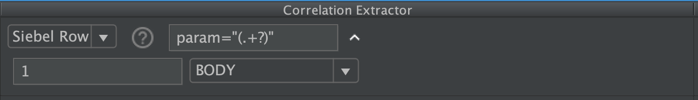

The Siebel Row Correlation Extractor works in a similar way like the previously mentioned RegEx, with the main differences that:

- This applies a "Siebel Star Array strings" parsing function over the matched regex and store the parsed values as variables.
- Regarding the Parameters expected, Siebel Row Correlation Extractor uses all but the *Match Number*, since it parses every match it founds.
- Last, but not least, if the Regex its matched, a JSR223PostProcessor will be added to the sampler.

*For a better understanding, lets do an example*

Let's say that the String we want to extract and, therefore, apply this extracting and parsing function, its

`8\*testUser12\*testPassword6\*VRId-0`

The plugin will search for the number before an occurrence of "\*", uses that value as the length of the number of characters to store, and then repeats if there is another occurrence of "*".

If the Reference Variable is set to *VAR*, the split strings returned will be set in variables names like ${VAR_1}, ${VAR_2}, ${VAR_3} etc. and, the count of variables is returned as ${VAR_n}.

The stored values for that string, at the end, will be:

* VAR_n=3
* VAR_1=testUser
* VAR_2=testPassword
* VAR_3=VRId-0

### Star Array Correlation

When the server returns variables using a star array, the plugin will parse the array and generate a new variable for each of the parameters, using the specified prefix name.


## Variable Generation

The creation of JMeter variables for later usage is one of the pillars of this plugin. Therefore, this section is specially dedicated to understand and review all the possible scenarios.

The generation and assignment of variables are tied to the Extractors which are the ones in charge of extracting the matches and store them. Therefore, a detailed explanation of extractor configuration will be covered during this section.

The most used and complex extractor is the [Regex Extractor](#list-of-correlation-extractors).
This section will be divided into cases, from simple and common cases to unusual ones.

### Extract specific match from the response (overwritable)

|  | Description |
|---|---|
| Objective | extract the second appearance of a character chain included on the response that matches the given regex |
| Configuration | need to specify a variable name (the variable stored will use it), regex, desired match number and no need to check for multi-valued |
| Visualization |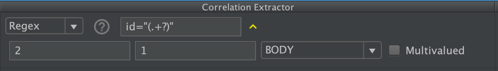 |
| Overall | value will be stored in a JMeter variable, with the exact name as the value introduced on the reference variable name field. **If a variable exists (from previous extractions) the variable will be overwritten with new match value** |

### Extract specific match from a response (not overwritable)
|  | Description |
|---|---|
| Objective | extract a certain value from a specific match number on the response. The value will be saved in a non-overwritable variable. | 
| Configuration | variable name, regex, desired match number and **multivalue must be selected** | 
| Visualization | 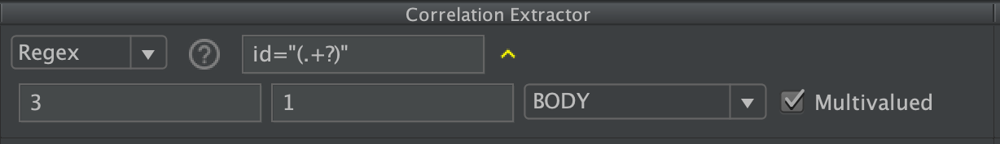 |
| Overall | value will be extracted and stored in a variable with the following convention: E.g: `var#34` <ul><li>**var**: reference variable name</li><li>**#34**: represents the variable count number</li></ul> Note: this variable will endure the whole execution | 

### Extract multiple variables that can be overwritten

|  | Description |
|---|---|
| Objective | extract all values that match the regex on the response |
| Configuration | variable name, regex, **match number needs to be lower than 0** (E.g: -1). No need for multi-valued. |
| Visualization |  |
| Overall | a new variable will be created to store every match found on the response. If the variable already exists, it will be overwritten. The format of this type of variable consists of a prefix (reference variable name) with an underscore followed by the integer which represents the match number of the extracted value. E.g: **ID_1** <br> **Important**: If variables are been extracted in previous responses, for instance, 5 matches (`ID_1, ID_2,..., ID_5`), when another response arrives with new matches, these variables will not just be overwritten, will be deleted. If the new response matches thrice, then the resultant variables will be `ID_1, ID_2, ID_3`. Previous variables `ID_4` and `ID_5` will no longer exist. |


### Extract multiple variables that can NOT be overwritten

|  | Description |
|------|---|
| Objective | extract all values that match the regex on the response and store them immutably |
| Configuration | variable name, regex, **match number needs to be lower than 0** (E.g: -1). **_Multi-valued needs to be checked_** |
| Visualization | 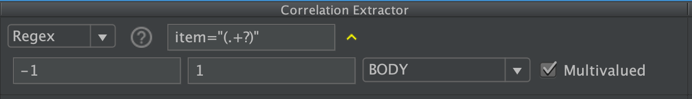 |
| Overall | a new variable will be created to store every match found on the response. This type of extractions have a particular format name. E.g:  `myVar#2_1` Where: <ul><li>**myVar**: reference variable name</li><li>**#2**: hash followed by the variable count number</li><li>**\_1**: number of match in that response</li></ul><br>New JMeter variables are created (with the format showed above) every time a response arrives, and the regex matches more than twice.<br> Note: if the response contains one match, and optimization is done. Therefore, the generated variable will be like in section  _Extract specific match from a response (not overwritable)_ |

## Variable Replacement

The replacement of dynamic or static data in a request for JMeter Variables is one of the main objectives of the **Correlation Recorder**.

Mainly, the idea is to replace data for variables, therefore, we get a proper correlated script.
The data we want to replace needs to match a certain regex, condition or even a criteria.
The variable replacement system does support the scenario when the match needs to be replaced for a literal instead of a JMeter Variable (not common case).

Let's give an example in order to set the idea of a replacement.
Suppose we have a website were is possible to buy products. Those products are identified by a unique id.
Our objective will be to replace the id number for a JMeter Variable, to later on, buy any product of the store just by modifying the JMeter Variable value.
Considering an url like `www.my-market-place.com/cart.html?product_id=2`
The regex we have to build in order to match the data we want to replace, it should be something like: `product_id=(\d)`.
The result we are looking for should be a request with a parametrized value, in that case, the id number.
The desired result will look something like:
`www.my-market-place.com/cart.html?product_id=${id_product}`

Now that we have a basic idea of a replacement, lets explain the most complex and used replacement. The *Regex Correlation Replacement* which accepts three parameters:

1. **regex**: the regex needed to match the data to be replaced on a request.
2. **replacementString**: this field is used to set JMeter Functions, or even literals to be used on the comparison of the replacement match value (if value is not ignored).
3. **ignore value**: this check will determine if the match will be compared against all the JMeter Variables or even the execution of a function that can be declared on the `replacementString` field. When is checked, it will replace without comparing.

>  Below is shown all the possible scenarios. Each scenario contains an *Objective* which will explain the problem we want to achieve. *Pre-loaded variables* will set us in a current variable context, in consideration of generating those variables is mandatory to read the section [variable-generation](#variable-generation). *Context* will provide all necessary information for the scenario, as a global configuration will work under the domain `www.my-market-place.com`. The *Visualization* will show the configuration made on the replacement in order to achieve the desired result.

### Replace single parameter for a variable in request
|                      | Description                                                                                                                                                                                                                         |  
|----------------------|-------------------------------------------------------------------------------------------------------------------------------------------------------------------------------------------------------------------------------------|  
| Objective            | replace a parameter of a request for a JMeter Variable.                                                                                                                                                                             |
| Pre-loaded variables | `ID` = 2                                                                                                                                                                                                                            | 
| Context              | Request is `/cart.html?product_id=2`                                                                                                                                                                                                | 
| Visualization        |                                                                                                                                  |  
| Overall              | Once the regex matches on the request, the matched value will be `2`. Then it will compare the matched value against all the variables stored. When the matched value equals any variable stored, the replacement will be triggered |
| Replacement result   | `www.my-market-place.com/cart.html?product_id=${ID}`                                                                                                                                                                                |

### Replace multiple parameters for variables in request
|                      | Description                                                                                                                                                                       |  
|----------------------|-----------------------------------------------------------------------------------------------------------------------------------------------------------------------------------|  
| Objective            | replace multiple parameters of a request for JMeter Variables.                                                                                                                    |
| Pre-loaded variables | `ID_1` = 2, `ID_2` = 3, `ID_3` = 4,  `ID_SESSION` = rP/tHk<tsR!v>                                                                                                                 | 
| Context              | Request is `/cart.html?product_id=2&product_id=4`                                                                                                                                 | 
| Visualization        | 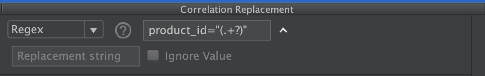                                                                           |  
| Overall              | For this multi replacement, the regex will match twice (two appearances of `product_id`), therefore, each matched value will be replaced for the variables containing same value. |
| Replacement result   | `www.my-market-place.com/cart.html?product_id=${ID_1}&product_id=${ID_3}`                                                                                                         |

### Replace a parameter for the result of a variable transformation in request
|                      | Description                                                                                                                                                                                                                                                                                                                                                                                                                                                                                                 |  
|----------------------|-------------------------------------------------------------------------------------------------------------------------------------------------------------------------------------------------------------------------------------------------------------------------------------------------------------------------------------------------------------------------------------------------------------------------------------------------------------------------------------------------------------|  
| Objective            | replace a parameter in request that uses a pre-loaded variable but transformed.                                                                                                                                                                                                                                                                                                                                                                                                                             |
| Pre-loaded variables | `ID` = 2,  `ID_SESSION` = rP/tHk<tsR!v>                                                                                                                                                                                                                                                                                                                                                                                                                                                                     | 
| Context              | Request is `/index.html?session=rP%2FtHk%3CtsR%21v%3E`. In this particular case, the session id is extracted decoded (*ID_SESSION* value) , but on the request it is encoded. Therefore, the stored variable will be different to the matched value on the request. Because of that, we need to use the field `replacementString` in order to make that transformation. For this example we are using a JMeter Function called [urlencode](https://jmeter.apache.org/usermanual/functions.html#__urlencode) | 
| Visualization        | 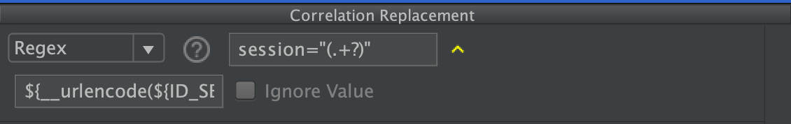                                                                                                                                                                                                                                                                                                                                                                                                     |  
| Overall              | Since the replacement string is not empty, the plugin will execute (if executable, could also be a literal) the content. The result of the execution will be used to compare against the regex replacement matched value. When those values match, the replacement is made by placing the content of replacementString on the request.                                                                                                                                                                      |
| Replacement result   | `www.my-market-place.com/index.html?session=${__urlencode(${ID_SESSION})}`                                                                                                                                                                                                                                                                                                                                                                                                                                  |

### Replace multiple parameters for the result of a variable transformation in request
|                      | Description                                                                                                                                                                                                                                                                                                                                                                                                                                                                                                                  |  
|----------------------|------------------------------------------------------------------------------------------------------------------------------------------------------------------------------------------------------------------------------------------------------------------------------------------------------------------------------------------------------------------------------------------------------------------------------------------------------------------------------------------------------------------------------|  
| Objective            | replace a parameter in request that uses pre-loaded variables but transformed.                                                                                                                                                                                                                                                                                                                                                                                                                                               |
| Pre-loaded variables | `prod_1=red car`,  `prod_2=blue car`                                                                                                                                                                                                                                                                                                                                                                                                                                                                                         | 
| Context              | Request is `delete.html?identifier=red+car&indetifier=blue+car`. In this case, we have to replace two parameters of the request. The value that will be placed on the request, needs to be encoded. Since the pre-loaded variables are not encoded, we need to make a transformation                                                                                                                                                                                                                                         | 
| Visualization        |                                                                                                                                                                                                                                                                                                                                                                                                                   |  
| Overall              | Similar to the previous scenario, in order to proper replace for variables, we have to make a transformation, that will be done by calling the [__urlencode](https://jmeter.apache.org/usermanual/functions.html#__urlencod) function provided by JMeter. Since the pre-loaded variables are result of a multiple extraction. The replacement string will have the variable name without the suffix. The plugin automatically will detect that and it will access to all the stored values for that reference variable name. |
| Replacement result   | `www.my-market-place.com/index.html?identifier=${__urlencode(${prod_1})}&identifier=${__urlencode(${prod_2})}`                                                                                                                                                                                                                                                                                                                                                                                                               |

### Replace single parameter ignoring matched value
|                      | Description                                                                                                                                                                                                                                                                                                                                                                        |  
|----------------------|------------------------------------------------------------------------------------------------------------------------------------------------------------------------------------------------------------------------------------------------------------------------------------------------------------------------------------------------------------------------------------|  
| Objective            | replace a parameter in request that uses pre-loaded variables but transformed.                                                                                                                                                                                                                                                                                                     |
| Pre-loaded variables | No variables used for this case                                                                                                                                                                                                                                                                                                                                                    | 
| Context              | Request is `/main.html?time=1516540541624`. This request contains a parameter which is the current time in milliseconds, therefore, if we had that value stored in a variable it will not work, since we need to set a request with the current time. Therefore we will use the function [__time()](https://jmeter.apache.org/usermanual/functions.html#__time) provided by JMeter | 
| Visualization        | 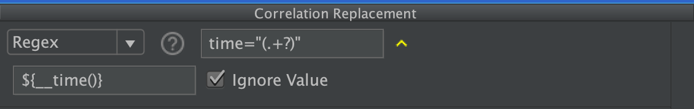                                                                                                                                                                                                                                                                                        |  
| Overall              | It is not possible to compare values in order to achieve our objective, therefore we need to set the current time neglecting the previous value. For that reason the ignore value is checked, it will not execute and compare the replacement string content.                                                                                                                      |
| Replacement result   | `www.my-market-place.com/main.html?time=${__time()}`                                                                                                                                                                                                                                                                                                                               |

## List of Correlation Replacements

All the Correlation Replacements mentioned below comes either installed by default in the plugin, or as a part of the preloaded Siebel Template. To know more about how to load and save Correlation Rules Templates, please refer to the [Saving and Loading Rules](#saving-and-loading-rules) section, for further details about it.

In case none of the following Replacements fits the desired behavior your application requires, to correlate the dynamic variables that it might have, feel free to read the [Customizing your one extensions](CUSTOM_EXTENSIONS.md) section that we have prepared for you.

**Regex**

Similarly to the *Correlation Extractor Regex*, this one also receives a Regular Expression in order to find where the stored value is going to be replaced. Additionally, if a regex extractor with multivalued was added, the replacement will be applied automatically. It will look for a variable with same value as the request match in order to make the replacement. In short, no need to configure replacement to work with a multi-value or single-value.

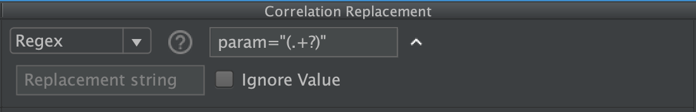

**JSON**

Similarly to the *JSON Correlation Extractor*, this one also receives a JSONPath Expression in order to find where the stored value is going to be replaced. Additionally, if a JSONPath extractor with multivalued was added, the replacement will be applied automatically. It will look for a variable with same value as the request match in order to make the replacement. In short, no need to configure replacement to work with a multi-value or single-value.

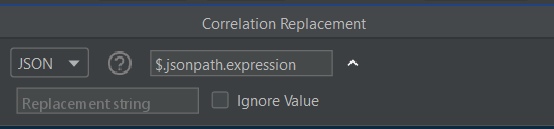

For examples of using JSONPath expressions, refer to the *JSON Correlation Extractor* documentation.

The logic behind **Replacement string** and **Ignore value** is the same as *Regex Correlation Replacement*. Go to the documentation related to **Variable Replacement** for usage examples.

**Siebel Counter**

This Correlation Replacement replaced the matched regex with a counter that holds the value of each time it has matched on the moment the replacement occurs.

**Siebel Row Id**

This replacement adds *_rowId* to the Reference Variable name before each replacement, and search the value of the regex on rows of the Siebel Context. After this, it behaves like a regular RegEx Replacement using the Siebel Context

**SiebelRowParams**

Similarly to the rest of the Correlation that involves Regex, this Replacement will receive a Regular Expression as param, its going to search for the first occurrence of the first group of (), inside the Siebel Context values, extracted previously by the SiebelRow's CorrelationExtractor, and replace the respective value following the formula `RefVar` + _ + `RowNumber`.

