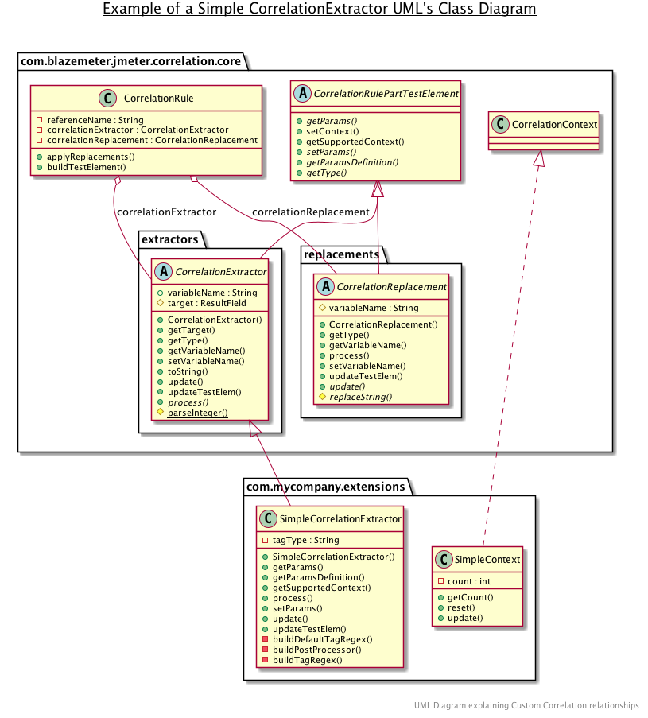

# Custom Extensions

When the current Correlation Extensions are not enough, you can create your own Correlation Extension.
In this guide we will explain how to create them and how you can extend the current ones.

## Requisites

These are the minimum requisites that you will need to start:

* Use java 1.8
* Maven 1.3+
* JMeter 5.2.1


## Dependencies

Before we begin with the elements that are required to create a Correlation Extension, we need to
add the Correlation Recorder as dependency. To do that, you need to add the following to your pom.xml:

1. The Correlation Recorder dependency
2. The JMeter dependency

An example of a basic pom.xml file would be:

```XML
<?xml version="1.0" encoding="UTF-8"?>
<project xmlns="http://maven.apache.org/POM/4.0.0" xmlns:xsi="http://www.w3.org/2001/XMLSchema-instance" 
xsi:schemaLocation="http://maven.apache.org/POM/4.0.0 http://maven.apache.org/maven-v4_0_0.xsd">
   <modelVersion>4.0.0</modelVersion>
   <properties>
      <project.build.sourceEncoding>UTF-8</project.build.sourceEncoding>
      <project.reporting.outputEncoding>UTF-8</project.reporting.outputEncoding>
      <jmeter.version>3.3</jmeter.version>
   </properties>
   <dependencies>
      <dependency>
         <groupId>org.apache.jmeter</groupId>
         <artifactId>ApacheJMeter_core</artifactId>
         <version>${jmeter.version}</version>
         <scope>provided</scope>
         <exclusions>
            <exclusion>
               <artifactId>commons-logging</artifactId>
               <groupId>commons-logging</groupId>
            </exclusion>
         </exclusions>
      </dependency>
      <dependency>
         <groupId>org.apache.jmeter</groupId>
         <artifactId>ApacheJMeter_http</artifactId>
         <version>${jmeter.version}</version>
      </dependency>
   </dependencies>
</project>
```

Include the [latest release](https://github.com/Blazemeter/CorrelationRecorder/releases/) of the plugin into your project.

One of the easiest ways to do so it's adding JitPack to your dependency file and then point to the plugin repository and version. For further information on how to add it to your project, refer to their [Official Documentation](https://jitpack.io/).

## Correlation Rule Structure

As mentioned in the Readme file, one Correlation Rule has 3 parts:

* A Reference Variable
* A Correlation Extractor
* A Correlation Replacement

### Reference Variable
Generally, a Reference Variable is a bridge between a value extracted from Correlation Extractor and a Correlation Replacement.

Is the name of the variable where the information extracted from a Correlation Extractor, will be stored and, from where the Correlation Replacements will obtain the information to replace it in the configured Responses.

### Correlation Extractor

A Correlation Extractor it's a part of the Rule that contains certain functions (like Regex, for example), that extracts from **each request**, the dynamic information and, stores it into the predefined Reference Variable.

### Correlation Replacement

Later on, in every subsequent response, the Correlation Replacement will figure out where it needs to replace the *extracted information*, that it’s stored in the *Reference Variable* corresponding to the Rule it belongs to.

## Order

It's important to take into consideration the order of the Correlation Rules, as they represent the priority in which they are applied. For example:

When a request is made, all C. Replacements will be applied first, in the order they appear in the list of rules.
When a response is received, only the ones that pass the Content-Type filter will be considered for Extraction. If left blank, all responses will be considered.
When a response is allowed, for the previous validation, all C. Extractors will be applied, in the order they appear in the list of rules.

When making your own Custom Extension, consider the order of the extracted values if you are going to depend on stored variables and, each replacement will use variables that were stored before they are applied.

## Relationships

The following diagram will contain all the relationships between the Rule and the previously mentioned parts.



To resume the UML Diagram:

Every Rule Will contain:

- One Reference Variable, which is a String
- One Correlation Extractor, which extends from CorrelationRulePartTestElement
- One Correlation Replacement, which also extends from CorrelationRulePartTestElement

During the process of making your Custom Correlation Extensions, you must extend one or another of the CorrelationRulePartTests elements, so the plugin can get the basic methods from it and place it with their respective set.

Its highly recommended that you check all those classes before continuing.

## CorrelationRulePartTestElement
This class, located at: `com.blazemeter.jmeter.correlation.core.CorrelationRulePartTestElement`, contains all the methods that allow the plugin, not only to build the interface which will be able to configure the Extension but also manages the Contexts.

## CorrelationExtractor
This class, located at: `com.blazemeter.jmeter.correlation.core.extractors.CorrelationExtractor`, contains the basic structure to be able to target the Responses, save the values once configured, and load the values from the files.

## CorrelationReplacement
This class, located at: `com.blazemeter.jmeter.correlation.core.replacements.CorrelationReplacement`, contains the basic structure to be able to target the Request, save the values once, and load the values from the files.

**Process of making your Extension**
In order to develop your Custom Extensions, you can either:

- Create from scratch a brand-new Extension, *extending* CorrelationExtractor/CorrelationReplacement, and implementing the desired customizations.
- Extend from an already created, tested, and exposed CorrelationExtractor/CorrelationReplacement, and fix the logic so it behaves the way you want it to do.

We recommend that you do the latter one since it's going to be easier to understand the flow of the plugin that way. You could take the whole, default installed, Siebel Extension package, for example, located at `com.blazemeter.jmeter.correlation.siebel`. Each one of those Custom Extensions, extend from one of the core classes and rewrite the logic to work on a Siebel Environment application.

Take the time to look at those files before going into the rest of the sections?

# Considerations

When developing and configuring a Correlation Rule, don't forget that there are certain parameters that need to be covered. Take them into account when implementing your extensions.

## A Valid Rule

A valid rule is one that has all the necessary components to be able to be saved, loaded, and applied when recording. For that, you need to consider:

* The Reference Variable must always be *Non-Empty*.
* Rules with only Reference Variables are not valid rules, and won’t allow either start recording or save the Correlation Template.

## JComponents allowed for each rule

At this very moment, when defining the fields for an Extension, the only allowed Components to be rendered are:

* JComboBox  (for list of static values)
* JTextFields (for variable values)

The values obtained by those Fields it’s received as a string and will be set into the rule with the `setParams(String ...)` method.
From that point on forward, you must validate the non-empty state of those values, and the required conversions (casting) of those values.

Read more about it in the [CustomCorrelationExtractor](https://github.com/Blazemeter/CorrelationRecorder/blob/master/examples/CustomCorrelationExtractor.java) example.

## Unique class names

*Better safe than sorry*

Try always to use names that are not repeated or that might collapse with the ones that are already developed. You don't want to load a class into the plugin and end up using another one by mistake.

# Make your own extensions

**Its highly recommended that you check the Class diagram displayed in [Relationships](#relationships) before jumping into this section**

## Basic Relationship on each rule part

The following set of rules should be followed in order to have the correct access to all the capabilities that we program in the plugin. That been said, please follow these instructions:

1. Each CorrelationExtractor or CorrelationReplacement extends `CorrelationRulePartTestElement`
2. Therefore, each Custom Extension that you develop should either extend CorrelationExtractor or CorrelationReplacement class, accordingly its type and the moment it will be applied.

   **Note**: The only exception to this rule it's when you want to enhance some functionalities of an already developed Extension, in that case, you could extend that class instead.

3. Each CorrelationExtractor or CorrelationReplacement has the possibility to use a CorrelationContext, that will allow covering a more inclusive and extensive set of variables. The CorrelationContexts are shared between each Extension that has it is assigned to. Depending on your personal needs and the complexity of your project, you might want to make your very own.

4. By default, none of the CorrelationExtractor or CorrelationReplacement has implemented the method `getSupportedContext()` from `CorrelationRulePartTestElement` unless it has its very set of complex variables that need to share between rules and Correlations. Like you could check in the Siebel's Extensions.

5. Each Correlation must be named using this standard:

```
{Name of the Functionality of the Correlation} + "Correlation" + The Type
```

This is important, in most of the cases, to properly show the name of the Extension in the respective combo box.

# Final Words

Review these links for a further understanding of correlating concepts and examples:

* [Siebel's Custom Extension explained](siebel_extension_explanations.md): an explanation of Siebel CRM’s Custom Extension.
* [Extensions and useful methods in the Flow](the_flow_explanation.md): detailed explanation of how correlation works.
* [Examples](https://github.com/Blazemeter/CorrelationRecorder/tree/master/examples): basic structure for a Correlation Extension.