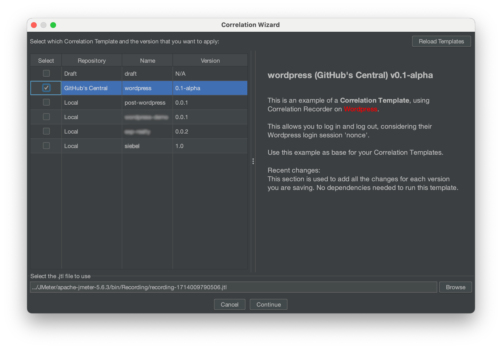
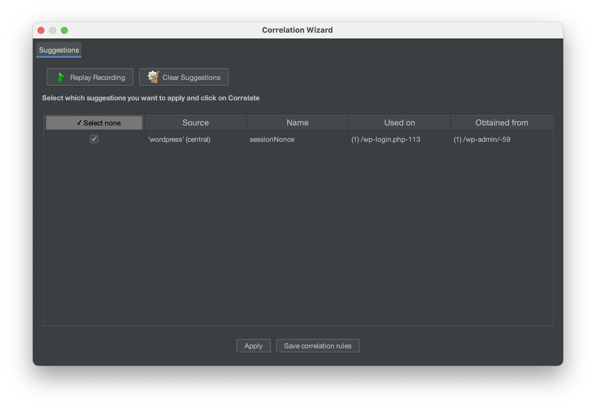

# Usage
In this page, we will explain the most common scenario when using the Correlation Recorder plugin, here you will:
- Learn how to [identify dynamic parameters](/guide/using-the-plugin.html#identifying-dynamic-parameters) in your test scripts
- Learn about Correlation Rules

You might also be interested in other usages such as:

- Storing your Rules in Correlation [Templates](/guide/correlation-templates.md)
- Managing your Correlation [Repositories](/guide/correlation-repositories.md)

## Identifying dynamic parameters
Either if you are new to the usage of JMeter or not, you will find that the Correlation Recorder plugin will help you
 to identify dynamic parameters in your test scripts, as they can be hard to find. The plugin will help you to
  identify them and create correlation rules for them.

There are three ways to properly identify dynamic parameters in your test scripts:

1. **Using the replay and compare feature**: This will replay your current test plan and obtain the parameters from 
 the requests that fail (those are very likely changing in each iteration), and display those for you. Correlations
  will be created automatically for you.
2. **Using the correlation templates**: This will use a set of pre-defined correlation templates that have been 
 specifically designed for different applications. You can use them to identify dynamic parameters in your test
  scripts and automatically create correlations for them. Local Correlation Templates are also supported. 
3. **Manually**: You can manually identify dynamic parameters in your test scripts, and manually correlating them.

In this guide, we will focus on the first two methods, as they are the most effective ones.

## Correlation Rules
Correlation Rules are the core of the Correlation Recorder plugin. They are the ones that will help you to identify
 dynamic parameters in your test scripts and correlate them.

You can create your own Rules or use the ones created by BlazeMeter or your team. 

You create them by yourself, there are two ways:

1. By using the [Replay and Compare](/guide/after-recording.html#by-replay-and-compare) feature
2. By creating the [Correlation Rules manually](/guide/correlation-rules.md)

The [Replay and Compare](/guide/after-recording.html#by-replay-and-compare) is a more exploratory approach, where the plugin attempts to automatically detect the dynamic values from request that failed, while [Correlation Rules manually](/guide/correlation-rules.md) is more effective, as you should know exactly what you are trying to correlate. 

We recommend using [Replay and Compare](/guide/after-recording.html#by-replay-and-compare) to identify potential dynamic values, their appearances in both responses and requests, and general rules to correlate then, and then fine tune those rules to properly correlate them.

If you are interested in using the Rules created by others, you can use the [Correlation Templates](/guide/correlation-templates.md) feature.

## Validating and testing the correlation rules

Once a correlation rule has been created, you can validate it to make sure it works as expected. To do so, you 
the comparison by "Correlation Rules" and "Correlation Templates" in the "Correlation Wizard" window.

To do so, first, save your Correlation Rules as a Correlation Template, then, click the "Correlation Wizard" button
 and select the "Correlation Templates" option. Select the template you just saved and click "Next". The plugin will
  apply the Correlation Template to your recording and, by the end of the analysis, the Correlation Suggestion window will be displayed, showing you the dynamic values detected from the Correlation Template you just used.

::: tip warning
If you are using the "Correlation Templates" option, remember that the plugin will apply every Correlation Template
you select in the "Correlation Wizard" window; hence, if you select more than one Correlation Template, the plugin
will apply all of them to your recording. This means that the Correlation Suggestion window will show you the dynamic
values detected from all the Correlation Templates you selected (not just the last one you created).
:::

## Applying correlation rules to test scripts

Regardless of the method that was used for the creation of the Rules, the plugin will allow the appliance of
 those rules in two different ways:

1. **[After the recording is done](/guide/using-the-plugin.html#applying-correlation-rules-after-the-recording-is-done)** (recommended)
2. **[During the recording](/guide/using-the-plugin.html#during-the-recording-legacy)** (legacy)

### Applying correlation rules after the recording is done

Since the release of the Correlation Recorder v2, we encourage the usage of this method to apply Correlation Rules, 
 as it is the faster and more reliable way to do so. To apply Correlation Rules after the recording is done, you
 need to follow these steps:

#### **TL;DR**

1. Open the Correlation Wizard
2. Select the **By Replay and Compare** method.
3. Select the Templates to use for the analysis.
4. Add the JTL file of the recording (if it isn't already loaded).
5. Press "Continue"
6. Review the Correlation Suggestions
7. Press "Auto Correlate" to apply the suggestions to the Test Plan.

With this, you should have a Test Plan with the dynamic values already correlated. Replay the Test Plan to make sure
that it works as expected.

#### **Detailed steps**

1. Open the Correlation Wizard

To open the Correlation Wizard, you can either:
- Accept the replay report Dialog, after the recording.
- Click on the **Correlation Wizard** button in the **Correlation** tab.

2. Select the **By Replay and Compare** method

Regardless of the method used, the "Select Correlation Method" dialog will be displayed.
Select the **Existing correlation rules (recommended** method and press "Continue".

3. Select the Templates to use for the analysis

The next step is to select the Correlation Templates to use for the analysis. You can select one or more templates.
If you select more than one, the plugin will use the union of the dynamic values found in all of them.

You can select which version of each Correlation Template to use. By default, the latest version is selected.

::: tip

Depending on your account type, you might see some Correlation Templates that are not available for you
(they will have a lock icon next to them).

If you want to know more about Enterprise Correlation Templates, please contact your BlazeMeter representative.
:::

4. Add the JTL file of the recording (if it isn't already loaded)

By default, the plugin loads the JTL file that is found in the View Result Tree of the "bzm - Correlation Recorder" element.
If you want to use a different JTL file, you can click on the "Browse" button and select the file you want to use.

::: warning
It is highly recommended that you use the JTL file that that comes from the recording, since it contains the
raw data of the recording. If you use a different JTL file, the analyzed data might not be accurate, hence
the results might not be as realistic as expected.
:::

5. Press "Continue"
6. Review the Correlation Suggestions
   Once the analysis is done, the plugin will display the Correlation Suggestions in the "Correlation Suggestions dialog".

Review the name of the arguments, the values, where they were found and used. If you want to apply a suggestion,
select the checkbox next to it. If you want to ignore a suggestion, uncheck the checkbox.

7. Press "Auto Correlate" to apply the suggestions to the Test Plan.

Once you are done reviewing the suggestions, press the "Auto Correlate" button to apply the suggestions to the Test Plan.
The plugin will automatically correlate the dynamic values in the Test Plan, and will display a dialog informing you
that the process was successful.

We recommend the usage of the first method, as it is faster and allows rolling back changes if needed.
The second method is still supported, but it is not recommended, as it is slower, making you to do the wh and does not allow rolling back changes.

### **During the recording** (legacy)

As mentioned before, this method is not recommended when testing your Correlation Rules, as it takes more time to test
 them, however, if you are sure your Correlation Rules are properly configured, the steps are pretty simple:

1. Select the "Enable Correlation (Legacy)" checkbox in the "bzm - Correlation Recorder" element.
2. Start the recording.
3. Once the recording is done, your correlations should be applied to your Test Plan.

You dont need to do anything else, as the rules should be applied directly in your Test Plan. You can replay and see
 the final result of your Test Plan.

::: tip warning
If you enable this check box, do the recording and then attempt to apply any of the Post Recording methods, we can't
 assure those will work properly, since the recording will contain elements that are already correlated or modified, 
 which might cause issues when identifying the dynamic values.
:::

## Using the History Manager
During the workflow with the Correlation Recorder, we usually record flows and then correlate messages, do tests, and investigate if we did our correlations correctly.

To make this job easier, the history manager arises.

This tool automatically saves checkpoints after relevant situations such as applying correlations, making a reply of our saved flow or after saving our original recording. After these saves are done, we can easily restore a version of our test plan with a few clicks and analyze the steps we did. 

### View the History

This feature allow us to see all the iterations we did since our original recording. The date we did them and a few details. 

To see the history we need to go to the Correlation Tab in the bzm-Correlation Recorder sampler and then click the Hisotry Button.

Once we click the history button, we will see this window

### Restore an Iteration

With this feature you are going to be able to select one iteration and restore your test plan at the point the iteration was saved. 

You just need to select one iteration and click the Restore button. After that you will see this message: 

when you click “ok” you are going to be redirected to your loaded testplan.

### Delete iteration.

You are able to delete the iterations you consider useless in your history. You just need to select every iteration you want to delete and click the delete button.

### Export all History

With this feature you are able to save and share the whole history. When you click the esport button, a zip file will be generated into the History folder of the bin folder where you have installed Jmeter. This zip file share the bin folder structure.

To see a history shared with you, you can do it from two ways:
1. You can extract its content in another bin folder and complement folders instead of substitute them.

2. Open the zip file and copy every fil into its corresponding folder inside the bin folder.

Then open the Test Plan associated with that history (usually it is shared outside the zip file) and go to the history.

